# SpartaMarket_DRF
**SpartaMarket_DRF**는 Django Rest Framework(DRF)를 활용하여 개발된 중고 거래 플랫폼의 백엔드 API 서버입니다. 이 프로젝트는 사용자 인증, 상품 등록 및 관리, 그리고 기타 관련 기능을 제공합니다.

---

## 주요기능
- **사용자 인증 및 관리**: JWT(JSON Web Token)를 통한 회원가입, 로그인, 프로필조회 기능을 지원합니다.

- **상품 관리**: 상품 등록, 조회, 수정, 삭제 기능을 제공합니다.

- **페이지네이션**: 상품 목록에 대한 페이지네이션 기능을 구현하여 사용자 경험을 향상시켰습니다.
---
## 개발환경
- 프로그래밍 언어: Python

- 프레임워크: Django 4.2, Django Rest Framework

- 데이터베이스: SQLite

- 인증 방식: JWT
---
## 설치 및 실행방법
1. 리포지토리 클론
``` bash
git clone https://github.com/guitter1/spartamarket_DRF.git
```

2. 가상환경 설치 및 활성화
``` bash
python -m venv venv
# Windows
venv\Scripts\activate
# macOS/Linux
source venv/bin/activate
```

3. 필수패키지 설치
``` bash
pip install -r requirements.txt
```

4. 마이그레이션 및 서버실행
```bash
python manage.py migrate
python manage.py runserver
```

---
## API 엔드포인트
1. 사용자 관련:

    - POST /api/accounts/: 회원가입
    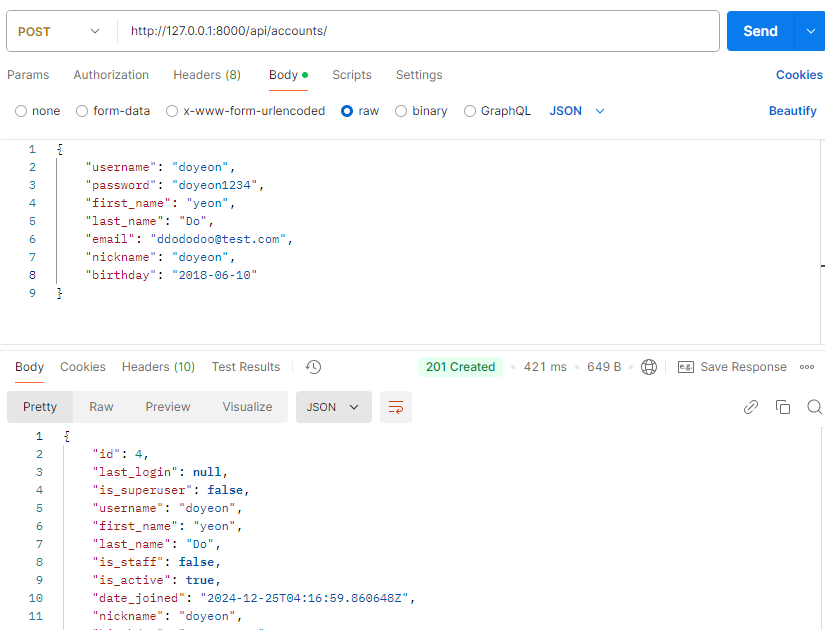

    - POST /api/accounts/login/: 로그인
    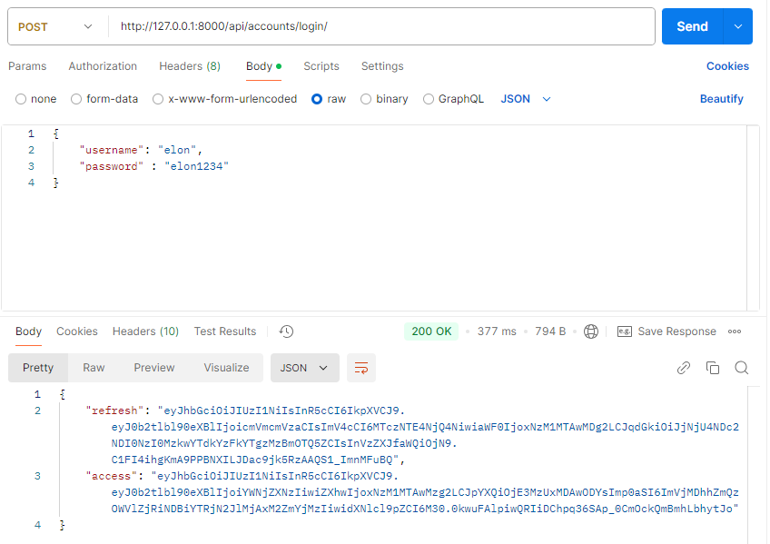
    로그인 실패(아이디/비밀번호 틀림)
    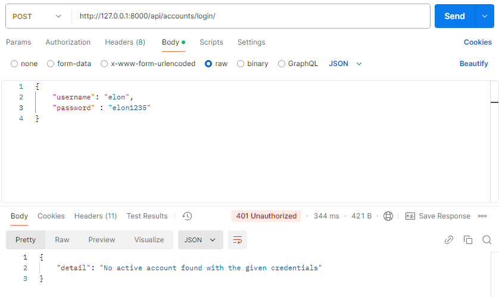

    - GET /api/accounts/<str:username>: 프로필조회
    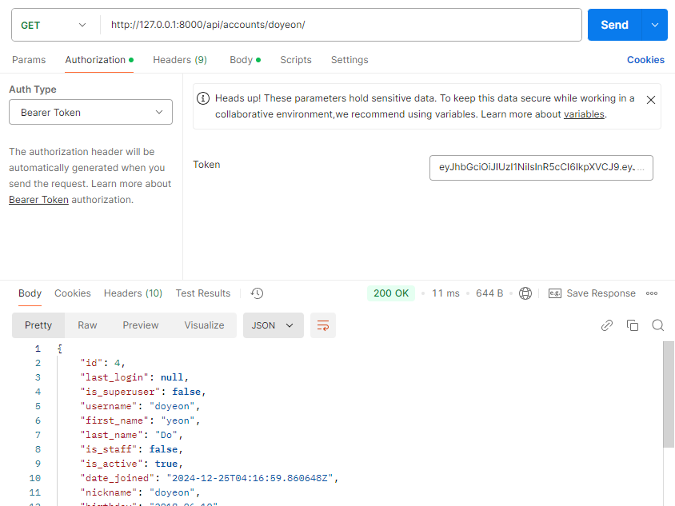
    프로필 조회 실패(로그인 안 됨)
    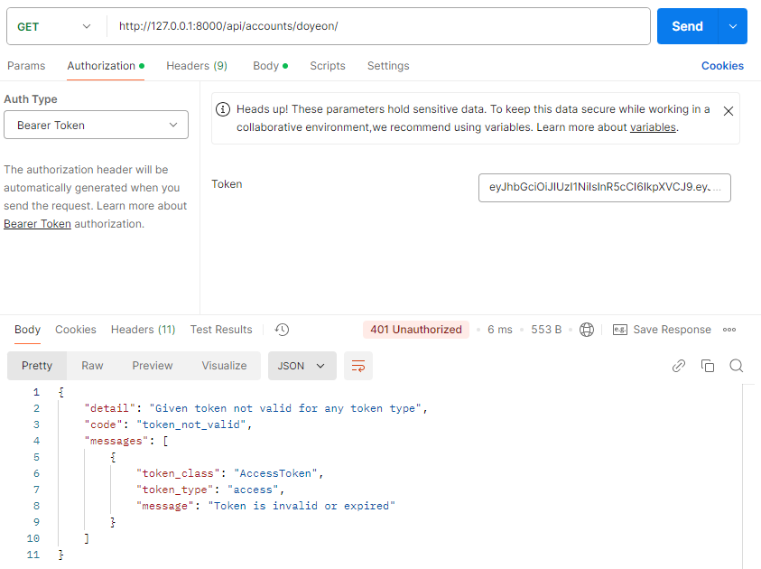

2. 상품 관련:

    - POST /api/products/: 상품 등록
    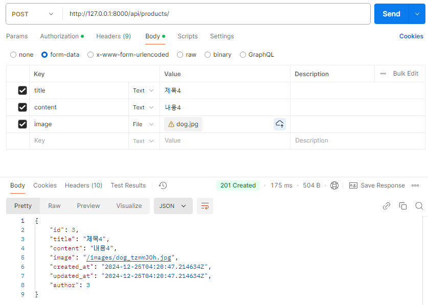
    상품 등록 실패(로그인 안 됨)
    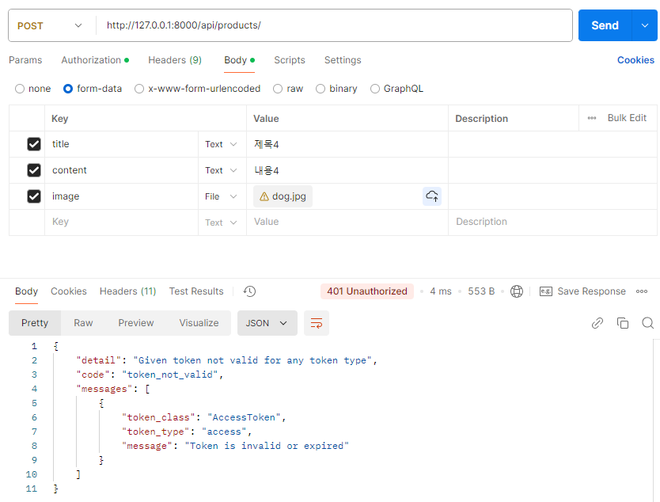

    - GET /api/products/: 상품 조회
    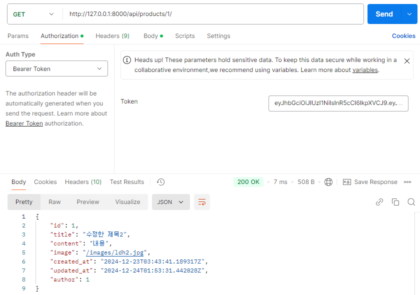

    - PUT /api/products/<productId>: 상품 수정
    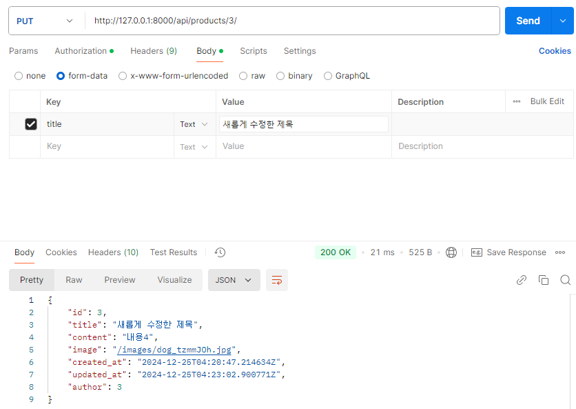
    상품 수정 실패(게시글 작성자가 아님)
    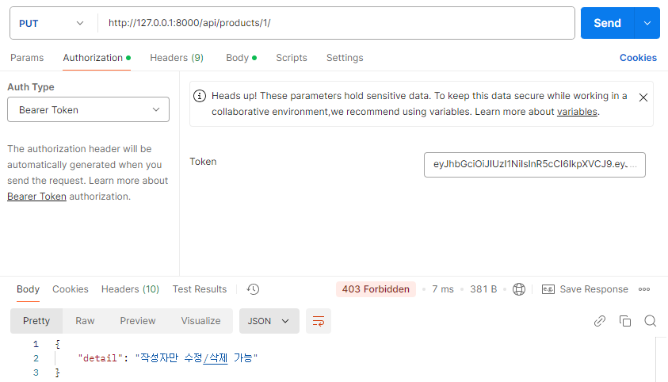

    - DELETE /api/products/<productId>: 상품 삭제
    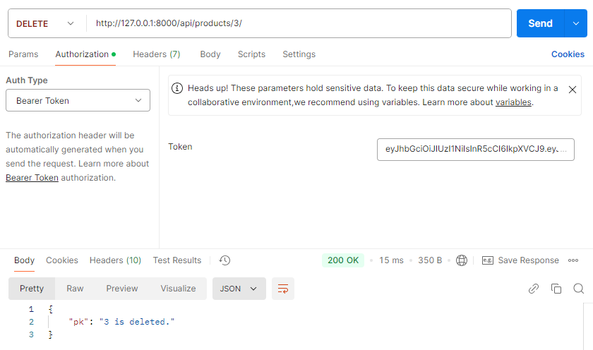

---
## 데이터베이스 모델링
- 사용자 모델: Django의 기본 User 모델을 확장하여 추가 필드를 포함시켰습니다.

- 상품 모델: 상품의 제목, 내용, 이미지, 가격 등의 정보를 저장하는 모델을 구현하였습니다.
---
## ERD

---
## 프로젝트 구조
```
spartamarket_DRF/
├── accounts/
│   ├── migrations/
│   ├── __init__.py
│   ├── admin.py
│   ├── apps.py
│   ├── models.py
│   ├── serializers.py
│   ├── tests.py
│   ├── urls.py
│   ├── validators.py
│   └── views.py
├── media/
│   └── images/
├── products/
│   ├── migrations/
│   ├── __init__.py
│   ├── admin.py
│   ├── apps.py
│   ├── models.py
│   ├── pagination.py
│   ├── serializers.py
│   ├── tests.py
│   ├── urls.py
│   └── views.py
├── spartamarket_DRF/
│   ├── __init__.py
│   ├── asgi.py
│   ├── settings.py
│   ├── urls.py
│   └── wsgi.py
├── manage.py
└── requirements.txt
```
---
## 트러블 슈팅

<details><summary>로그인페이지 접속에러</summary>

기존 코드:
accounts>users.py
    
```
urlpatterns = [
    path("", views.UserAPIView.as_view()),
    path("<str:username>/", views.UserAPIView.as_view()),
    path("login/", TokenObtainPairView.as_view()),
    ]
```

에러메시지: TypeError at /api/accounts/login/UserAPIView.post() got an unexpected keyword argument 'username'
Request Method:	POST
Request URL: http://127.0.0.1:8000/api/accounts/login/

원인: 장고는 url패턴을 위에서부터 하나씩 일치시키기 때문에 login/ 페이지로 들어가려는 의도였지만 login을 <str:username>으로 받아들여 오류발생

해결: 리스트 내부 url 순서 수정
수정코드:
```
urlpatterns = [
    path("login/", TokenObtainPairView.as_view()),  # 로그인 URL을 먼저 배치
    path("<str:username>/", views.UserAPIView.as_view()), 
    path("", views.UserAPIView.as_view()),
]
```
</details>

<details><summary>로그인 권한 체크 문제</summary>
기존 코드:
products>views.py

```
class ProductDetailAPIView(APIView):
    def get_object(self, pk):
        return get_object_or_404(Product, pk=pk)
    
    def author_check(self, product, user):
        if product.author != user:
            return Response(status=status.HTTP_401_UNAUTHORIZED)
    
    def get(self, request, pk):
        product=self.get_object(pk)
        serializer=ProductSerializer(product)
        return Response(serializer.data)
    
    def put(self, request, pk):
        product=self.get_object(pk)
        self.author_check(product, request.user)
        serializer=ProductSerializer(product, data=request.data, partial=True)
        if serializer.is_valid(raise_exception=True):
            serializer.save()
            return Response(serializer.data)

    def delete(self, request, pk):
        product=self.get_object(pk)
        self.author_check(product, request.user)       
        product.delete()
        data={"pk":f"{pk} is deleted."}
        return Response(data, status=status.HTTP_200_OK)
```
문제점: 토큰을 넣지 않아도 게시글 수정 및 삭제 가능
-> 구현하고자 했던 것은 로그인 한 사용자인지 검증 후 게시글 작성자와 일치하는지 확인하여 수정/삭제 권한 부여하는 로직

원인
1. author_check에서 권한이 없을 경우 중단시키지 못하고 Response만 반환하고 있음
2. 로그인한 사용자인지 확인하는 로직이 없음

해결
1. author_check에서 PermissionDenied 예외가 발생하도록 수정
2. permission_classes 추가

수정한 코드

```
from rest_framework.permissions import IsAuthenticated

class ProductDetailAPIView(APIView):
    permission_classes = [IsAuthenticated]  

    def get_object(self, pk):
        return get_object_or_404(Product, pk=pk)

    def author_check(self, product, user):
        if product.author != user:
            raise PermissionDenied("작성자만 수정/삭제 가능")

    def get(self, request, pk):
        product = self.get_object(pk)
        serializer = ProductSerializer(product)
        return Response(serializer.data)

    def put(self, request, pk):
        product = self.get_object(pk)
        self.author_check(product, request.user)
        serializer = ProductSerializer(product, data=request.data, partial=True)
        if serializer.is_valid(raise_exception=True):
            serializer.save()
            return Response(serializer.data)

    def delete(self, request, pk):
        product = self.get_object(pk)
        self.author_check(product, request.user)
        product.delete()
        data = {"pk": f"{pk} is deleted."}
        return Response(data, status=status.HTTP_200_OK)

```

</details>


---
## 참고자료
- Django 공식 문서: https://docs.djangoproject.com/

- Django Rest Framework 공식 문서: https://www.django-rest-framework.org/